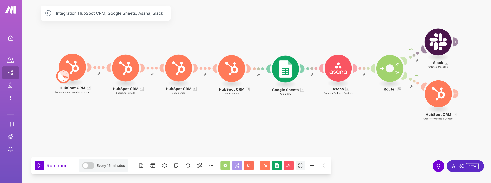
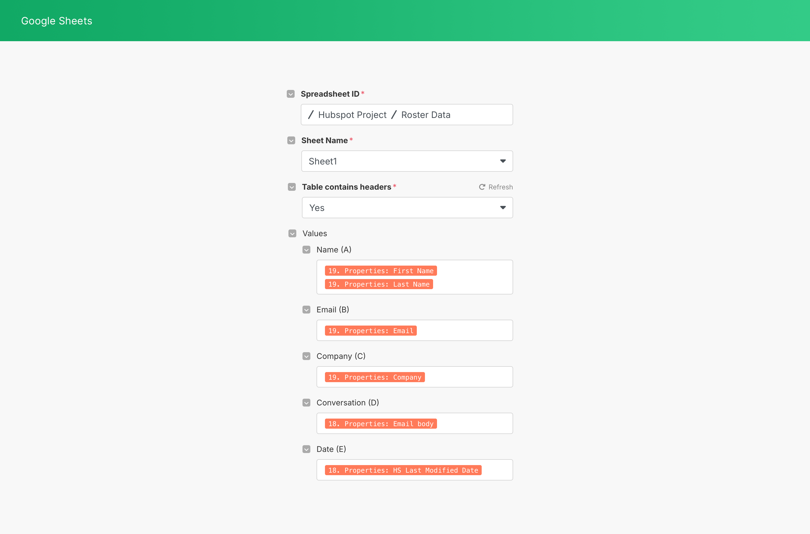
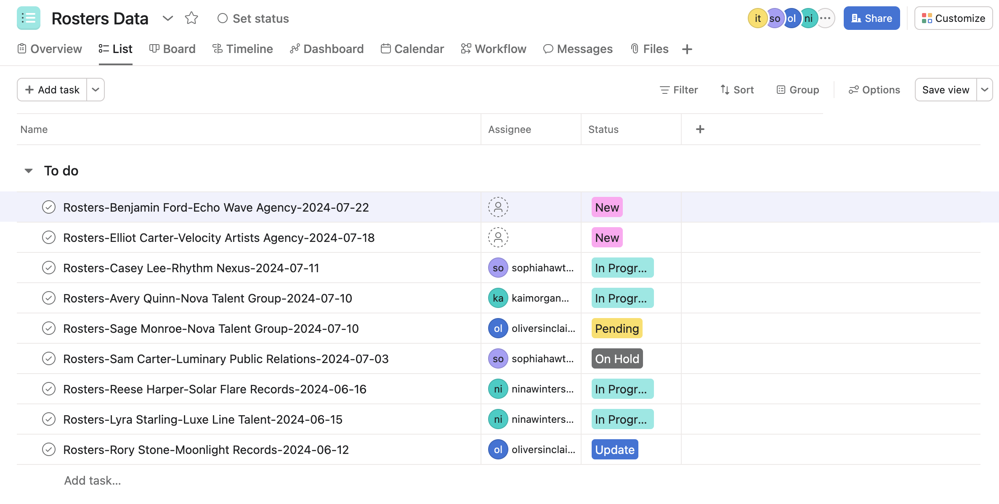

# Standardized Data Integration Process

###### _Tools: HubSpot, Google Sheets, Make_
 

## **Overview**

A data company I work with maintained an established process for handling incoming client roster updates, but the workflow was highly manual, requiring extensive copying and pasting across multiple platforms. The process also involved multiple team members working across time zones, which introduced delays and increased the risk of errors during handoffs.

To address this, I designed and implemented an automated workflow using Make.com to improve data integrity, reduce manual labor, and streamline communication across tools like HubSpot, Google Sheets, Asana, and Slack.

Rather than continuing to rely on fragmented manual processes, we decided to automate the most time-consuming parts of the workflow. The solution demonstrates how automation can eliminate bottlenecks, improve accuracy, and ensure our team can act quickly on new information.

## **Business Context**

I built this project to solve data coordination issues for a growing entertainment data company. The team maintains a comprehensive database of entertainment industry talent (actors, musicians, comedians, and athletes) by continuously collecting client roster data from partner agencies. These partners regularly send updated roster information through email, which the team historically had to extract manually, then enter into spreadsheets, and track in project management systems.
This manual process introduced several pain points:

* Time-consuming data entry caused delays in updating key databases.
* Disjointed tools (email, spreadsheets, task managers) required constant context switching.
* Data integrity risks due to human error or missed communication.
* No real-time alerting system to notify the team when action was needed.

The goal was to automate as much of this pipeline as possible, from the moment updated information arrives via email, to tracking and alerting the team to take action, which ultimately increases efficiency, accountability, and data reliability.

## **Overview of the Workflow**

This Make.com scenario connects five platforms: HubSpot, Gmail (via HubSpot integration), Google Sheets, Asana, and Slack. 

Whenever we receive a roster list from a partner, the data coordinator adds the contact on the “Leads” email list. Then, we send the email containing the roster to our email address, rosters@domain.com, where we compile all of the roster data we receive.

### Step 1: Set Trigger as Watch for Members Added to a List

The workflow begins when a new contact is added to a static list in HubSpot called "Leads."

### Step 2: Search for Roster Emails

Once a new member is added to the list, the automation searches HubSpot for emails that have been sent to rosters@domain.com.

### Step 3: Retrieve the Email Content

The automation then retrieves the full content of the email using the unique email ID. This step ensures we capture the latest communication containing the updated roster.

### Step 4: Get Contact Details from HubSpot

Additional metadata about the contact is pulled from HubSpot, including their name, company (agency), and email address. This contextual data is essential for downstream processing.

### Step 5: Add a New Row to Google Sheets

The contact details and the email content are added as a new row in a centralized Google Sheet. This sheet acts as our internal record and can be used for reporting or historical tracking.

### Step 6: Create a Task in Asana

Using the same information, a task is automatically created in Asana. The task title is formatted using values from the Google Sheet (i.e.,, "Rosters-[Contact Name]-[Agency]-[Date]"). The full content of the email is included in the task description to give team members the data and context they need.

### Step 7: Notify Team in Slack

Once the task is created, a message is sent to the #rosters Slack channel. This alert includes the task name and a direct link to the Asana task. Team members who are online can immediately assign the task to themselves.

### Step 8: Update Contact List Membership in HubSpot

Finally, the automation updates the contact’s list membership in HubSpot by removing them from the "Leads" list and adding them to the "Partners" list. This step helps maintain CRM hygiene and ensures contacts are categorized correctly for future workflows.

## **Impact and Results**
This Make.com automation significantly reduced the amount of time spent on manual data entry and coordination, with immediate benefits:

* **Time savings:** Manual data transfer that once took hours per week is now fully automated.
* **Increased accuracy:** Structured data capture eliminates common entry errors.
* **Team responsiveness:** Real-time Slack alerts ensure updates are acted on faster.
* **Audit-ready data:** All emails and actions are now logged across Sheets, Asana, and HubSpot.

## **Why This Matters**

To address the fragmented nature of our workflow, I built an end-to-end solution that connects each tool through Make.com. The solution demonstrates how automation can eliminate bottlenecks, improve accuracy, and ensure our team can act quickly on new information. By connecting the tools we already use, we were able to create a streamlined workflow that reduces manual work and supports better decision-making.

This project reflects how we can drive efficiency through thoughtful process design and smart automation. It highlights the important role of identifying bottlenecks, working across APIs, and building reliable solutions that solve real business problems.
